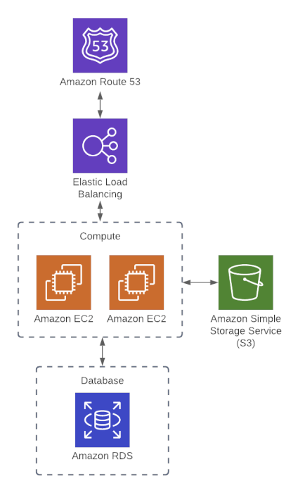

## Web-App

Generic web application architecture including:
- EC2 instances
- S3 bucket
- RDS instance
- Load balancer

**In this project, we'll be using Terraform variables to organize our code better instead of putting all configurations in a single main.tf file. This approach makes our infrastructure code more maintainable and reusable.**

## Architecture

## Examples to understand variables in terraform
[Examples for Terraform Variables](./examples/README.md)